# GRBL - fork for Polargraph (wall draw bot)

This code is a fork of GRBL, adding code to support wall draw bots based on some of ilaro's code changes.
* Original GRBL: https://github.com/gnea/grbl
* Ilaro's polar modifications used for some code: https://github.com/ilaro-org/grbl-polar

Major changes to original GRBL
* Coordinate system - drive motors with polargraph setup
* Servo motor support (for pen)
* No homing support

You will need
* A 3D printer (or someone who can print out a few parts)
* Some soldering skills to fix the CNC board
* Wires, screws

# Hardware

## Mechanics

### Motor mounts

* Motor mounts with motor and 20T gear
  * 3D model: [Polargraph / Vertical Plotter Spring Tensioned Motor Mount](https://www.thingiverse.com/thing:3440067)
  * Motor: NEMA17 1.8 degree motor, example eBay: "Nema 17 Stepper Motor 44Ncm 1.7A 38mm 12V 4-wire w/ 1m Cable for CNC 3D Printer"

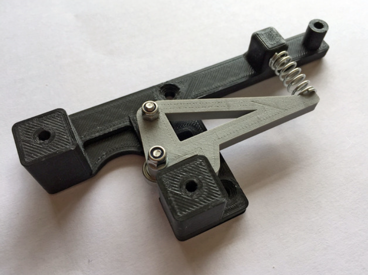

### Gondola

* Gondola with servo motor and pen
  * [Kritzlerbot Polargraph (printable)](https://www.thingiverse.com/thing:16692)
  * SG90 servo, example item: "Mini SG90 Micro Servo Motor 9G RC Robot Arm Helicopter Airplane Remote Control"
  * Servo extension cables

* Belt (GT2)
  * Example eBay item: "GT2 6mm Timing Belt and 20 Teeth 5mm Bore Pulleys Prusa Reprap 3D printer part"

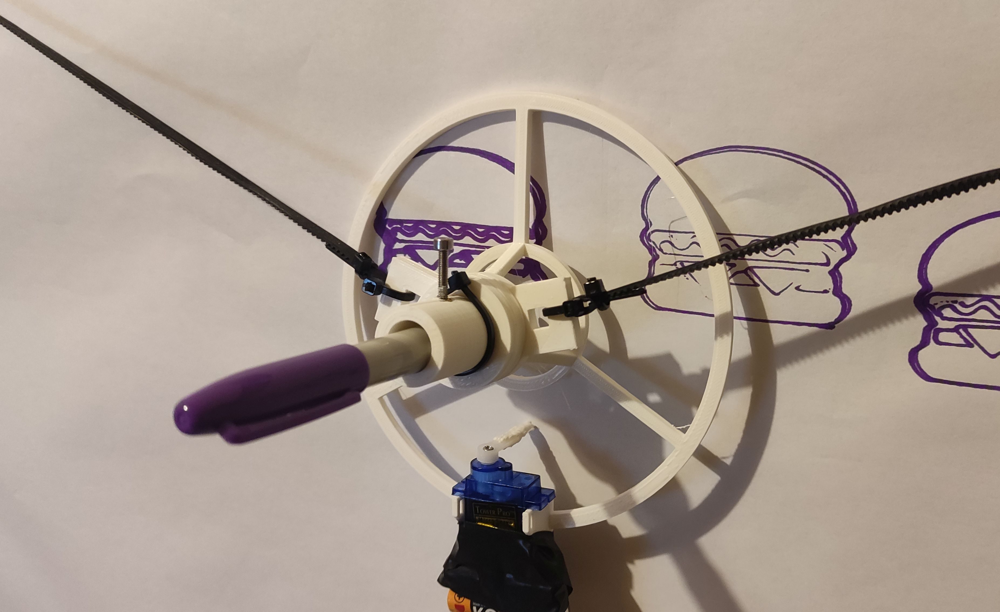

### Frame Assembled

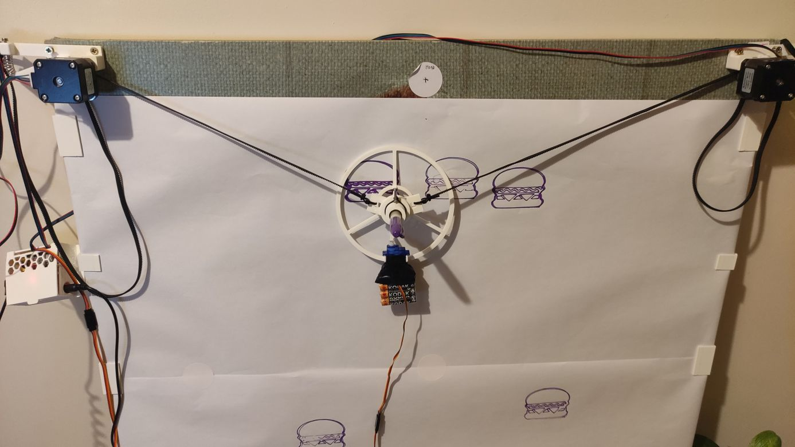

## Electronics

Components:
* Arduino Nano (mini USB connector)
* 12V Power supply unit (barrel), 2A minimum
* CNC Shield V4
  * Beware of the bugs and quirks of the board
* 2 x Stepper motor driver modules A4988

### CNC Shield

The CNC Shield v4 board is a quick and cheap way to create a controller for the polargraph. However the documentation is buggy (lists the wrong pin connections) and the microstepping jumpers near modules are useless, they have to be removed and the MS1/2/3/ pins of modules have to be manually soldered.
 You can read more details below if you're curious:
 https://www.instructables.com/How-to-Use-the-CNC-V4-Board-despite-Its-quirks/

We only need to populate the X and Y stepper axis modules on the board.

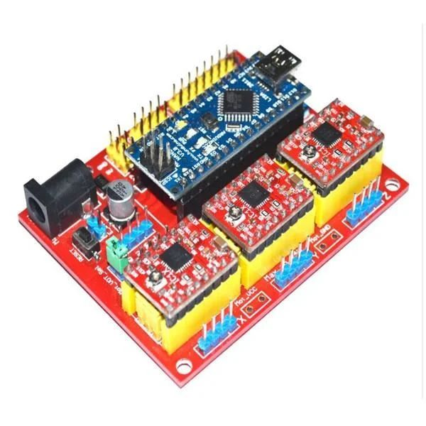

Pinout:
| Arduino Pin | Atmega port | Connected to |
| ----- | ----- | ----- |
| 2 | PD2 | Stepper X Direction
| 3 | PD3 | Stepper Y Direction
| 4 | PD4 | Stepper Z Direction (unused)
| 5 | PD5 | Stepper X Step
| 6 | PD6 | Stepper Y Step
| 7 | PD7 | Stepper Z Step (unused)
| 8 | PB0 | Stepper enable (all three modules)
| 11| PB3 | Servo PWM signal

Atmega ports are only for reference if you want to match it up with cpu_map_polargraph.h

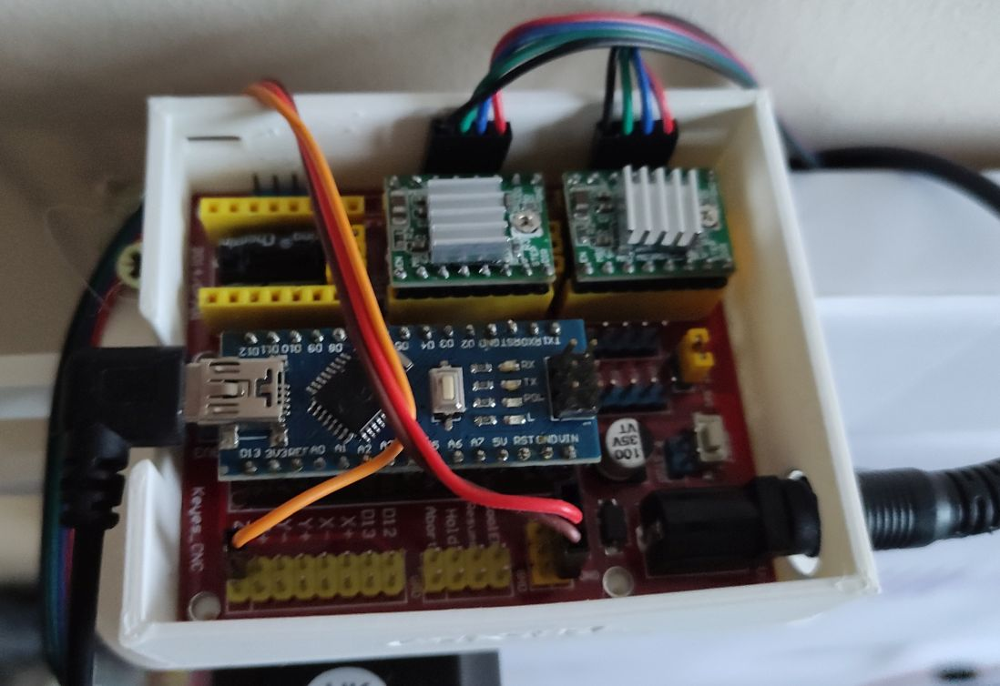

You might need to adjust the A4988 servo driver board motor current with the small potentiometer, there are [instructions on how to do this](https://www.the-diy-life.com/how-to-correctly-set-the-motor-current-limit-on-an-a4988-stepper-motor-driver/).

## Firmware

GRBL firmware loading onto Arduino Nano

1. Copy the GRBL library: 
   * From the source tree\grbl
   * To the arduino library folder, on windows this is User home\Documents\Arduino\libraries\grbl
   * You should see files in that folder like config.h, cpu_map.h, etc. 
2. Restart Arduino IDE
3. Open File -> Examples -> grbl -> grplUpload
   * This will load the grbl upload sketch
4. Make sure the board is configured, Tools -> Board
   * Board: Arduino Nano
   * Processor: Atmega328P - if you have a clone you might need (Old Bootloader)
   * Port: COM6 - or whatever your port is
5. Press upload, this will compile the source code and upload it to the Arduino Nano.
  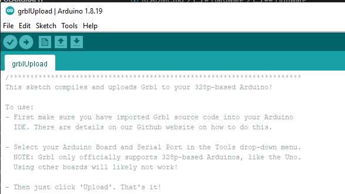
6. You are done. You can optionally open the Arduino Serial Console (icon/menu), make sure speed is set to 115200 and you should see the boot up text: "Grbl" appearing.

# Software (PC)

## Universal G-Code Sender

Download UGS from: https://winder.github.io/ugs_website/

Then start bin\ugsplatform64.exe (on Windows)

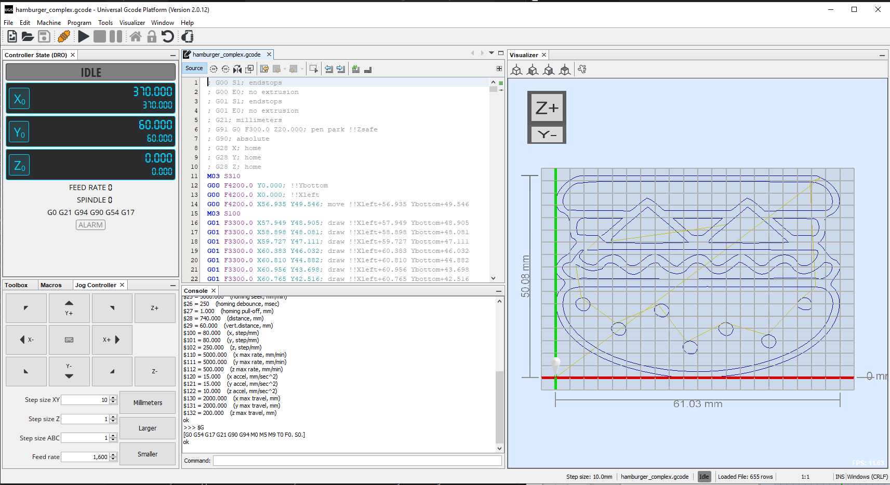

Sample g-code files can be found in the source tree for testing:

* sample_print_gcodes/hamburger_complex.gcode - [Complex hamburger gcode file](sample_print_gcodes/hamburger_complex.gcode)
* sample_print_gcodes/hamburger_simple.gcode - [Simple hamburger gcode file](sample_print_gcodes/hamburger_simple.gcode)

### Quickstarter for UGS:

1. Select the COM port, baud on top and press the Connect icon (to the left)
  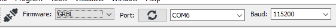
2. This will connect and show you the GRBL version and current parameters.
  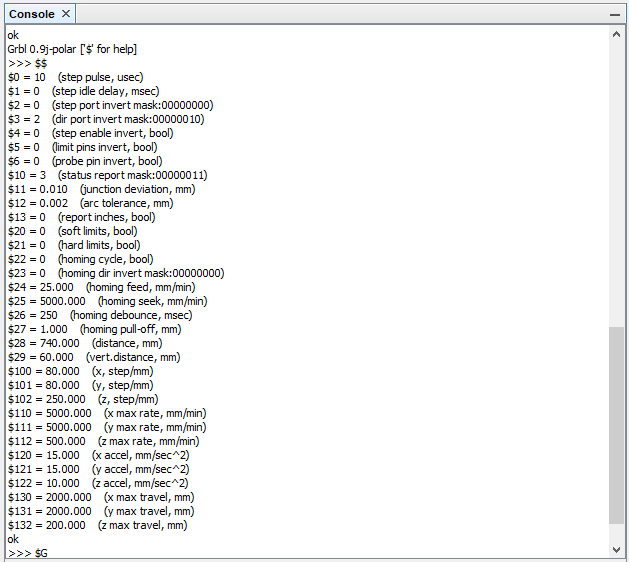
   * Check parameters, especially \$28, \$29 (width of your board in millimeters, vertical home distance).
   * Check the steps/millimeters settings (\$100,\$101)
   * If (some of the) motors are going the wrong way when you move around (Y+/Y-) then you can either turn the cable connected to the CNC board or use \$3 to invert directions
3. Make sure the Gondola is in the middle top position (home position), adjust belts manually. On my printer this is X=370 (mm), Y=60 (mm), but this varies. X is always half of the width distance (\$28), Y is \$29
4. Try to move the gondola around using the Jog controls. Set Step size XY to 10 millimeters.
  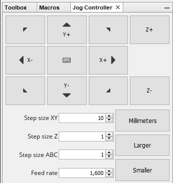
  * When you press Y+ the gondola should move down
    * If the gondola moves up, both motors need direction reversing
    * If the gondola moves left or right, one motor direction needs reversing
  * When you press X- the gondola should move left and right for X+
5. Move the gondola somewhat down and optionally a bit left, then issue the "set home here" command in the Console window prompt
   `G92 X0 Y0`
6. Load the sample gcode with the file open icon (top left in UGS)
   * Once this is done, you will see the gcode appear (top middle in UGS) and the image preview (top right)
7. Press "Play" icon on the top toolbar to start sending of the loaded gcode image. This will start the printing.
8. Once it is finished, you can issue the "reset gcode offset to original" command in the console:
   `G92.1`
9. Now you can move around more and print more, but remember to always send the home (G92 X0 Y0) and then reset it (G92.1) when finished.

## Configuration of GRBL parameters

Connect to the cnc module from Universal G-Code Sender with the appropriate port (eg. COM6). In the console window on the bottom:

* Enter $$ to list all parameters stored in EEPROM
* Change the following parameters - if needed

Parameter summary
| Param | Value | Description |
| --- | --- | --- |
| $100 | 80 | steps/mm (X), for 20 tooth gear and 16 microsteps with GT2 betlt it's 80
| $101 | 80 | steps/mm (X), for 20 tooth gear and 16 microsteps with GT2 
| $3   | 0  | Invert motors mask. If stepper X is going in wrong direction, set value=1, if stepper Y then set value=2, if both set value=3. Or you could just turn the board connector around
| $28 | 740 | Distance (horizontal) between two motors (gears) in millimeters
| $29 |  60 | Distance (vertical) when gondola is homed from the top (millimeters)

Useful g-codes

| G-Code    | Description |
| --------- | --- |
| M03 S310  | Pen up, move servo to 310 degrees (you might have different value for degrees) |
| M03 S100  | Pen down (100 degrees) |
| G92 X0 Y0 | Set an offset in all coordinate systems, sets the current position to be (0,0) |
| G92.1     | Reset the offset to the original system |

## Inkscape

Inkscape export to g-code:

 * Documentation on how to [use Inkscape to Generate Gcode](https://wiki.opensourceecology.org/wiki/Using_Inkscape_to_Generate_Gcode)
   * Install GcodePlot plugin
   * File > Save As, 3-axis gcode plotter...
     * Change any properies as needed. Make sure to set the Cutting settings -> Lift and Down commands to the pen up/pen down gcode values
     * You will need to edit the saved .gcode file manually to remove all lines before the first "M03 S310" because the previous lines would do positioning and homing, we don't need that. Alternatively you can find the plugin python source code and comment out these lines so save doesn't generate them.

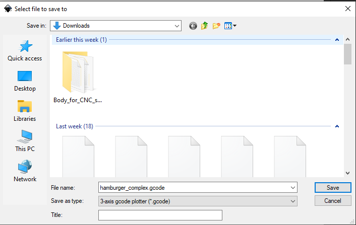
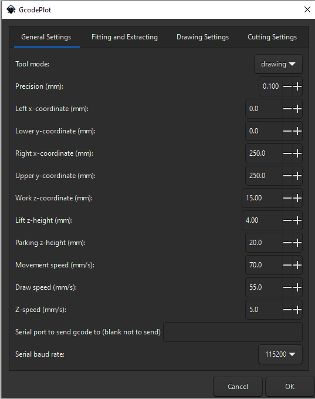

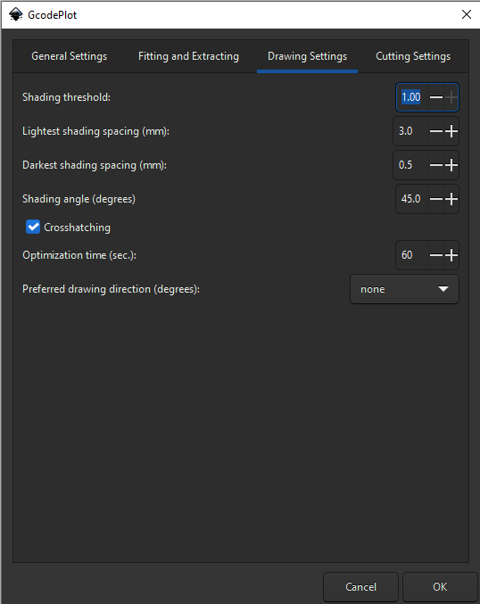
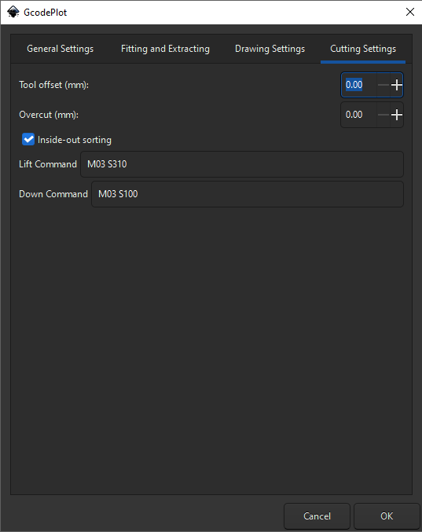

