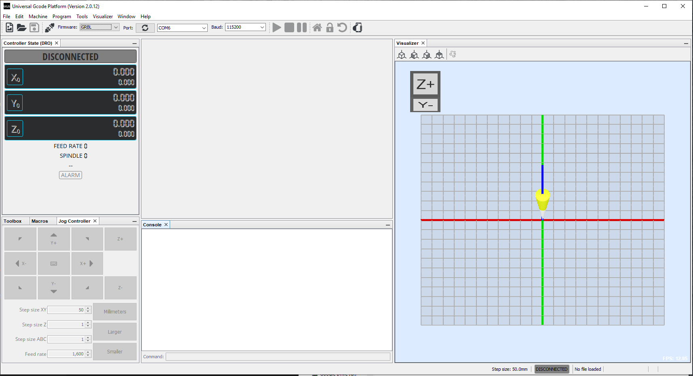

# GRBL - fork for Polargraph (wall draw bot)


This code is a fork of GRBL, adding code to support wall draw bots based on some of ilaro's code changes.
* Original GRBL: https://github.com/gnea/grbl
* Ilaro's polar modifications used for some code: https://github.com/ilaro-org/grbl-polar

Major changes to original GRBL
* Coordinate system - drive motors with polargraph setup
* Servo motor support (for pen)
* No homing support

You will need
* A 3D printer (or someone who can print out a few parts)
* Some soldering skills to fix the CNC board
* Wires, screws

## Hardware

### Mechanics

* Motor mounts with motor and 20T gear
  * 3D model: [Polargraph / Vertical Plotter Spring Tensioned Motor Mount](https://www.thingiverse.com/thing:3440067)
  * Motor: NEMA17 1.8 degree motor, example eBay: "Nema 17 Stepper Motor 44Ncm 1.7A 38mm 12V 4-wire w/ 1m Cable for CNC 3D Printer"
* Belt (GT2)
  * Example eBay: "GT2 6mm Timing Belt and 20 Teeth 5mm Bore Pulleys Prusa Reprap 3D printer part"
* Gondola with servo motor and pen
  * [Kritzlerbot Polargraph (printable)](https://www.thingiverse.com/thing:16692)
  * SG90 servo, example: "Mini SG90 Micro Servo Motor 9G RC Robot Arm Helicopter Airplane Remote Control"
  * Servo extension cables

### Electronics

Components:
* Arduino Nano (mini USB connector)
* 12V Power supply unit (barrel), 2A minimum
* CNC Shield V4
  * Beware of the bugs and quirks of the board
* 2 x Stepper motor driver modules A4988

#### CNC Shield

The CNC Shield v4 board is a quick and cheap way to create a controller for the polargraph. However the documentation is buggy (lists the wrong pin connections) and the microstepping jumpers near modules are useless, they have to be removed and the MS1/2/3/ pins of modules have to be manually soldered.
 You can read more details below if you're curious:
 https://www.instructables.com/How-to-Use-the-CNC-V4-Board-despite-Its-quirks/

We only need to populate the X and Y stepper axis modules on the board.

Pinout:
| Arduino Pin | Atmega port | Connected to |
| ----- | ----- | ----- |
| 2 | PD2 | Stepper X Direction
| 3 | PD3 | Stepper Y Direction
| 4 | PD4 | Stepper Z Direction (unused)
| 5 | PD5 | Stepper X Step
| 6 | PD6 | Stepper Y Step
| 7 | PD7 | Stepper Z Step (unused)
| 8 | PB0 | Stepper enable (all three modules)
| 11| PB3 | Servo PWM signal

Atmega ports are only for reference if you want to match it up with cpu_map_polargraph.h

... Servo and stepper connections picture HERE ...


## Software (PC)

### Universal G-Code Sender



### Configuration

Connect to the cnc module from Universal G-Code Sender with the appropriate port (eg. COM6). In the console window on the bottom:

* Enter $$ to list all parameters stored in EEPROM
* Change the following parameters - if needed
  * x

Parameter summary
| Param | Value | Description |
| --- | --- | --- |
| $100 | 80 | steps/mm (X), for 20 tooth gear and 16 microsteps with GT2 betlt it's 80
| $101 | 80 | steps/mm (X), for 20 tooth gear and 16 microsteps with GT2 
| $3   | 0  | Invert motors mask. If stepper X is going in wrong direction, set value=1, if stepper Y then set value=2, if both set value=3. Or you could just turn the board connector around
| $28 | 740 | Distance (horizontal) between two motors (gears) in millimeters
| $29 |  60 | Distance (vertical) when gondola is homed from the top (millimeters)

Pen up and down

Pen up:
M03 S310

Pen down:
M03 S100

Offsets:
G92 means “set an offset in all coordinate systems”.
G92 X0 Y0
G92.1 -> reset the previous offsets

### Inkscape

Inkscape export to g-code:

 * Documentation on how to [use Inkscape to Generate Gcode](https://wiki.opensourceecology.org/wiki/Using_Inkscape_to_Generate_Gcode)
   * Install GcodePlot plugin
   * File > Save As, 3-axis gcode plotter...


## Notes

### GRBL coordinate handling

Describe...


``` 
List of Supported G-Codes in Grbl v0.9 Master:
  - Non-Modal Commands: G4, G10L2, G10L20, G28, G30, G28.1, G30.1, G53, G92, G92.1
  - Motion Modes: G0, G1, G2, G3, G38.2, G38.3, G38.4, G38.5, G80
  - Feed Rate Modes: G93, G94
  - Unit Modes: G20, G21
  - Distance Modes: G90, G91
  - Arc IJK Distance Modes: G91.1
  - Plane Select Modes: G17, G18, G19
  - Tool Length Offset Modes: G43.1, G49
  - Cutter Compensation Modes: G40
  - Coordinate System Modes: G54, G55, G56, G57, G58, G59
  - Control Modes: G61
  - Program Flow: M0, M1, M2, M30*
  - Coolant Control: M7*, M8, M9
  - Spindle Control: M3, M4, M5
  - Valid Non-Command Words: F, I, J, K, L, N, P, R, S, T, X, Y, Z
```
